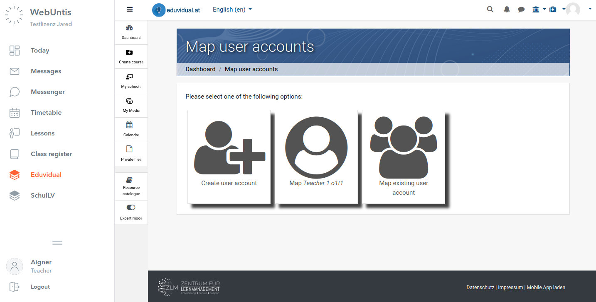
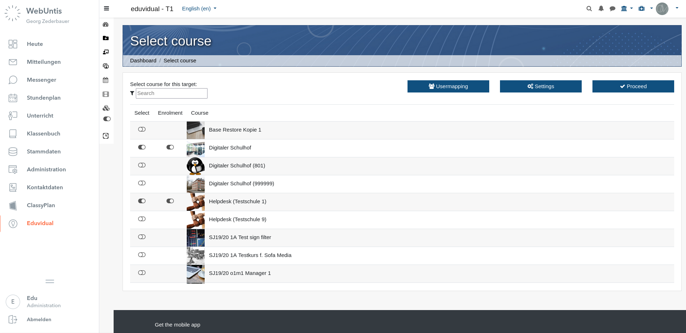
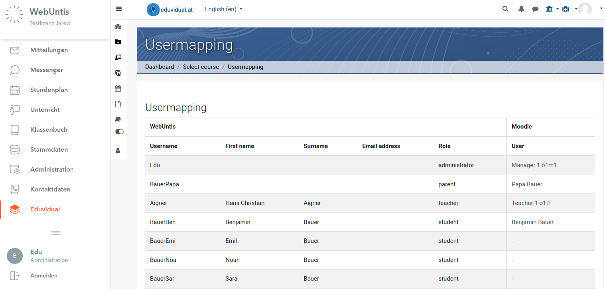
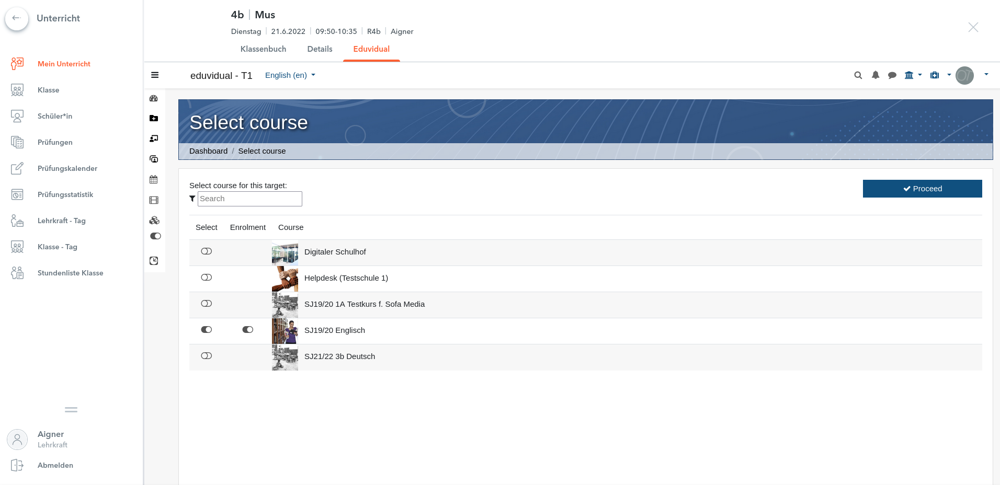

# moodle-local_webuntis

This plugins allows a connection between Moodle and WebUntis Instances of https://webuntis.com.

## About this plugin
This plugin allows an integration of Moodle with WebUntis. The core features are:
- User mapping
- User creation based on WebUntis profile data *)
- Mapping of courses for particular links inside WebUntis (main menu and lesson pages)
- Automatic user enrolment to courses (can be disabled in sitewide in Moodle administration or for particular courses)
- For admins: List of user mappings

## Using this plugin
To use this plugin, you need at least on WebUntis instance and a running Moodle site.

At first, login to your WebUntis instance as Administrator and add the Moodle "platform". As soon as you save the platform, oAuth credentials are transferred from WebUntis to your Moodle-Instance in the background. You can check these in the Website-Configuration of local_webuntis under "tenants". Follow the required steps within WebUntis to add the platform to the various navigation nodes in WebUntis for each user role.

When you're done, links to your Moodle site are shown in the main menu of WebUntis and on each lesson page. When a user clicks on such link for the first time, a mapping of user accounts is required (also for the WebUntis-Administrator!)

### User mapping
Users can now choose to map an existing Moodle account, or create a new one*). Once this user map has been created, the user is automatically logged in each time. This user mapping can be disconnected by the user using the Button "Disconnect from webuntis" in the Moodle main menu.

Attention: When external login systems like oAuth are used, the login procedure opens in a new tab. This is due to the reason, that these don't allow to be embedded in an iframe. Due to technical reasons, the browser must not be run in private mode! After the user was mapped, everything runs fine within the iframe.

### Tenant specific administration
Using the link to the Moodle on the main menu of WebUntis, the WebUntis-Administrator can choose a target course, and open particular settings regarding the behavior of the sync between WebUntis and Moodle. Using the trigger "Enrolment" it can be decided, if users are automatically enrolled to the course(s), when they open the link in WebUntis. Attention: this feature can be disabled globally using the Moodle site administration.

At the "settings" page the WebUntis-Administrator can configure options regarding the particular Webuntis tenant. The option regarding the creation of user accounts based on WebUntis profile data must be enabled in the Moodle Website-Administration and on this page too for each WebUntis tenant. This ensures that the consent was given by the Moodle Administrator and the WebUntis Administrator as well. The mapping of user roles as shown on the following screenshot only applies to Moodle sites that use the "eduvidual"-Plugin. This plugin allows to manage several organisations within one Moodle site with separated managements. The user role of WebUntis can be mapped to each organization individually. Moodle sites that don't use eduvidual, simply do not show this option.

Lastly, the WebUntis Administrator can view a list of actual user mappings.

Future versions of this plugin may provide an option for user synchronisation, management of the user mapping by the Administrator, or bulk creation of user accounts.

### Lesson specific configuration

The target course of lesson pages can be selected by Teachers and Administrators. The functionality is the same as with the main menu link.  Using the trigger "Enrolment" it can be decided, if users are automatically enrolled to the course(s), when they open the link in WebUntis. Attention: this feature can be disabled globally using the Moodle site administration.

------------------------------------
*) Can be disabled in the Moodle Website-Administration, requires sufficient profile data in WebUntis!

## Changelog
### 1.6.1 (Build: 2022070800)
According to Untis GmbH, the URL of the integration environment has changed from api-integration.webuntis.com to api.integration.webuntis.dev. The upgrade to version 1.6.1 is only required, if you are using the integration environment of Untis.

### 1.6 (Build: 2022062000)

Added feature that triggers auto enrolment per course. If admin setting 'local_webuntis/autoenrolforce' is set to the default value, teachers can set per course if users should be automatically enrolled. The admin setting can also disable the feature entirely for the whole Moodle site, or force the enrolment for all courses.

Function \local_webuntis\lessonmap::get_lesson_role now uses server2server API.

As of 27th June 2022, Untis changes the URL of its integration environment. Hence, both options are recognized as integration-environments: integration.webuntis.com and tom.integration.webuntis.dev.
